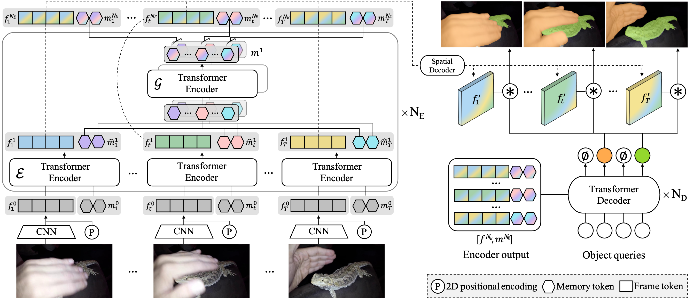

# Video Instance Segmentation using Inter-Frame Communication Transformers (NeurIPS 2021)
<div align="center">
  
</div>

## Paper
[Video Instance Segmentation using Inter-Frame Communication Transformers](https://arxiv.org/abs/2106.03299)

### Note
* Based on [detectron2](https://github.com/facebookresearch/detectron2) and [DETR](https://github.com/facebookresearch/detr) (Used commit : [76ec0a2](https://github.com/facebookresearch/detectron2/commit/76ec0a2042f742bd8a16dfc81d76d42e24e96792)).
* The codes are under [projects/](projects/) folder, which follows the convention of detectron2.
* You can easily import our project to the latest detectron2 by following below.
  - inserting [projects/IFC](projects/IFC) folder
  - updating [detectron2/projects/__init\_\_.py](detectron2/projects/__init__.py)
  - updating [setup.py](./setup.py)

### Steps

1. Installation.

Install YouTube-VIS API following the [link](https://github.com/youtubevos/cocoapi).\
Install the repository by the following command. Follow Detectron2 for details.
```bash
git clone https://github.com/sukjunhwang/IFC.git
cd IFC
pip install -e .
```

2. Link datasets

COCO
```bash
mkdir -p datasets/coco
ln -s /path_to_coco_dataset/annotations datasets/coco/annotations
ln -s /path_to_coco_dataset/train2017 datasets/coco/train2017
ln -s /path_to_coco_dataset/val2017 datasets/coco/val2017
```

YTVIS 2019
```bash
mkdir -p datasets/ytvis_2019
ln -s /path_to_ytvis2019_dataset datasets/ytvis_2019
```
We expect ytvis_2019 folder to be like
```
└── ytvis_2019
    ├── train
    │   ├── Annotations
    │   ├── JPEGImages
    │   └── meta.json
    ├── valid
    │   ├── Annotations
    │   ├── JPEGImages
    │   └── meta.json
    ├── test
    │   ├── Annotations
    │   ├── JPEGImages
    │   └── meta.json
    ├── train.json
    ├── valid.json
    └── test.json
```

3.

Training w/ 8 GPUs (if changing the batch size, please refer https://arxiv.org/abs/1711.00489)
* Our suggestion is to use 8 GPUs.
* Pretraining on COCO requires >= 16G GPU memory, while finetuning on YTVIS requires less.
```bash
python projects/IFC/train_net.py --num-gpus 8 \
    --config-file projects/IFC/configs/base_ytvis.yaml \
    MODEL.WEIGHTS path/to/model.pth
```

Evaluating on YTVIS 2019.\
We support multi-gpu evaluation and $F_NUM denotes the window size.
```bash
python projects/IFC/train_net.py --num-gpus 8 --eval-only \
    --config-file projects/IFC/configs/base_ytvis.yaml \
    MODEL.WEIGHTS path/to/model.pth \
    INPUT.SAMPLING_FRAME_NUM $F_NUM
```

## Model Checkpoints (YTVIS 2019)
Due to the small size of YTVIS dataset, the scores may fluctuate even if retrained with the same configuration.

**Note:** The provided checkpoints are the ones with *highest* accuracies from multiple training attempts.
If you are planning to cite IFC and its scores, we suggest you to refer the average scores reported in camera-ready version of NeurIPS.

| backbone  | stride | FPS |  AP  | AP50 | AP75 |  AR1 |  AR10 | download |
|:----------|:------:|:----:|:----:|:----:|:----:|:----:|:-----:|:--------:|
| [ResNet-50](projects/IFC/configs/base_ytvis.yaml) | T=5<br>T=36 | 46.5<br>107.1 | 41.6<br>42.8 | 63.2<br>65.8 | 45.6<br>46.8 | 43.6<br>43.8 | 53.0<br>51.2 | [model](https://drive.google.com/file/d/1i2ChMm-jfilWdqEjEbfm0prKNh9_N-uK/view?usp=sharing) \| [results](https://drive.google.com/file/d/1dBVkIyYGDe8Lh18dBYO9a5OsdvcBhDSG/view?usp=sharing) |
| [ResNet-101](projects/IFC/configs/base_ytvis.yaml) | T=36 | 89.4 | 44.6 | 69.2 | 49.5 | 44.0 | 52.1 | [model](https://drive.google.com/file/d/14leBVbWo4pWt_YvK-SLhd3W2S6mR0yV7/view?usp=sharing) \| [results](https://drive.google.com/file/d/1EnjCBUsvDeCyM5Pp9KRko_cbty9-KZIz/view?usp=sharing) |
## License

IFC is released under the [Apache 2.0 license](LICENSE).

## Citing

If our work is useful in your project, please consider citing us.

```BibTeX
@article{hwang2021video,
  title   = {Video Instance Segmentation using Inter-Frame Communication Transformers},
  author  = {Hwang, Sukjun and Heo, Miran and Oh, Seoung Wug and Kim, Seon Joo},
  journal = {arXiv preprint arXiv:2106.03299},
  year    = {2021}
}
```

## Acknowledgement
We highly appreciate all previous works that influenced our project.\
Special thanks to facebookresearch for their wonderful codes that have been publicly released ([detectron2](https://github.com/facebookresearch/detectron2), [DETR](https://github.com/facebookresearch/detr)).
